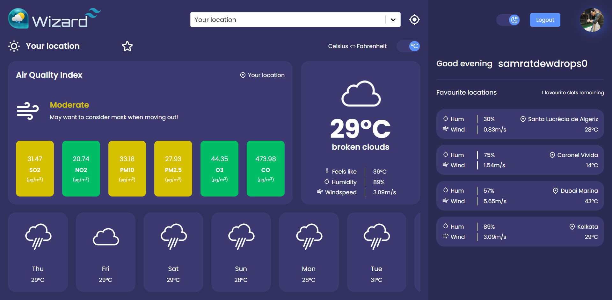

# Weather Wizard

A weather application built with React Js to display realtime weather data of a location, with additional functionality of user authentication and favorites list.



<!-- TABLE OF CONTENTS -->
<details>
  <summary>Table of Contents</summary>
  <ol>
    <li>
      <a href="#about-the-project">About The Project</a>
      <ul>
        <li><a href="#built-with">Built With</a></li>
      </ul>
    </li>
    <li>
      <a href="#getting-started">Getting Started</a>
      <ul>
        <li><a href="#prerequisites">Prerequisites</a></li>
        <li><a href="#installation">Installation</a></li>
      </ul>
    </li>
    <li><a href="#features">Features</a></li>
    <li><a href="#contributing">Contributing</a></li>
    <li><a href="#license">License</a></li>
    <li><a href="#view-demo">View Demo</a></li>
    <li><a href="#contact">Contact</a></li>
  </ol>
</details>

### Built With

- [React](https://reactjs.org/)
- [Open Weather Map](https://openweathermap.org/api/)
- [Redux](https://redux.js.org/)

## Getting Started

### Prerequisites

Install [Nodejs](https://nodejs.org/en/) from the official site. Create account in [OpenWeatherMap](https://openweathermap.org/api) and [RapidAPI/Geodb](https://rapidapi.com/wirefreethought/api/geodb-cities) to get started with the api.

### Installation

_Follow the following steps to install and setup the environment._

1. Clone the repo
   ```sh
   git clone https://github.com/Samrat-14/weather-app.git
   ```
2. Once inside the cloned repo, get started with installing the node modules.
   ```sh
   npm install
   ```
3. Start the server for frontend.
   ```sh
   npm start
   ```
4. After the installments are over, you can get started with the project.

## Features

- Dynamic weather data from API.
- City and country wise weather data fetching.
- SignIn / SignOut functionality.
- Favorities cities page as per star marked.
- Light and Dark theme.
- Contains temperture converter functionlity in Celcius / Fahrenheit.
- Used redux for API data management.

## Contributing

I love contributions, so please feel free to fix bugs, improve things, provide documentation.
If you have a suggestion that would make this better, please fork the repo and create a pull request. You can also simply open an issue with the tag "enhancement".
Don't forget to give the project a star! Thanks again!

1. Fork the Project
2. Create your Feature Branch (`git checkout -b feature/AmazingFeature`)
3. Commit your Changes (`git commit -m 'Add some AmazingFeature'`)
4. Push to the Branch (`git push origin feature/AmazingFeature`)
5. Open a Pull Request

<!-- LICENSE -->

## License

Distributed under the MIT License. See `LICENSE` for more information.

## View Demo

Live Demo: [https://samrat-weather-app.netlify.app/](https://samrat-weather-app.netlify.app/)

## Contact

[Samrat Sadhu](https://samrat-14.github.io/my-portfolio/) - samrat.sadhu.14@gmail.com
